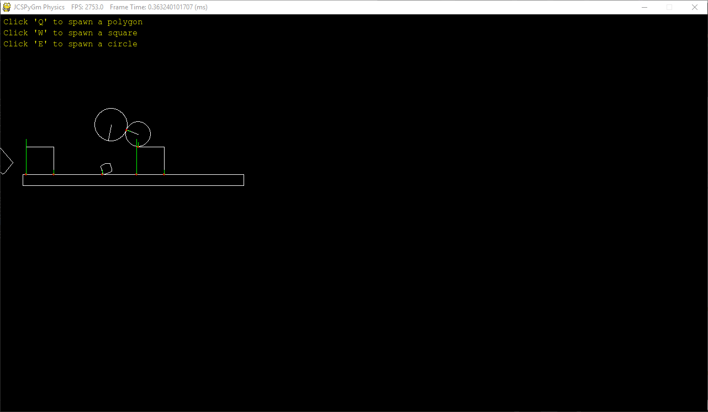

# Impule Engine #

This is un-official port of Impulse Engine Created by Jen-Chieh Shen

NOTE: I made this project while learning physics and python
at the same time. I already have the basic programming skills
while I code this project. I decide to port this project
because I do not want to just learn the programming language
without making meaningful program. Hope this project help
other people who also have the same circumstance as mine.   

** Original Author: **  
C++: https://github.com/tutsplus/ImpulseEngine (Randy Gaul)   

** Other Programming Laguage Port: **  
Java: https://github.com/ClickerMonkey/ImpulseEngine (Philip Diffenderfer)   

### Screen Shot ###

